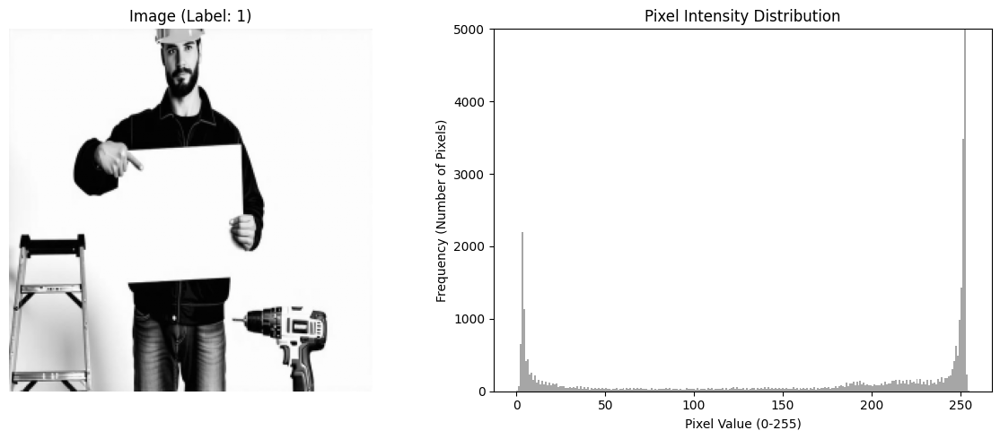
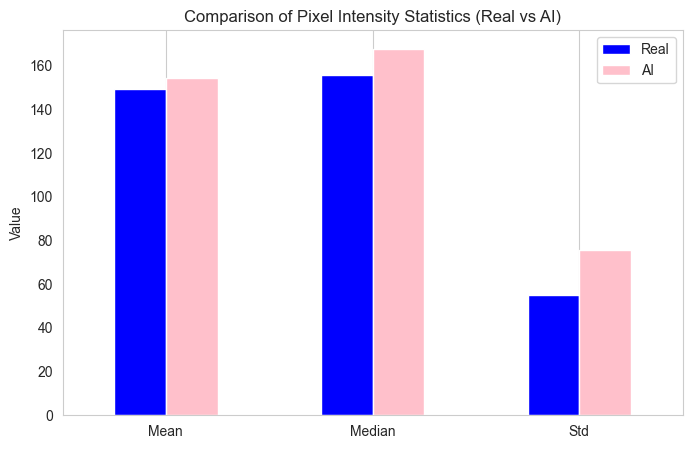
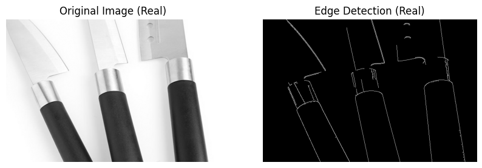
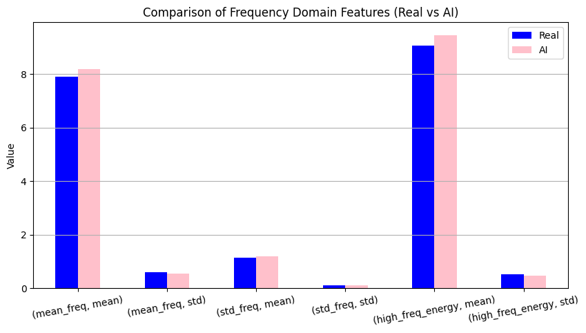
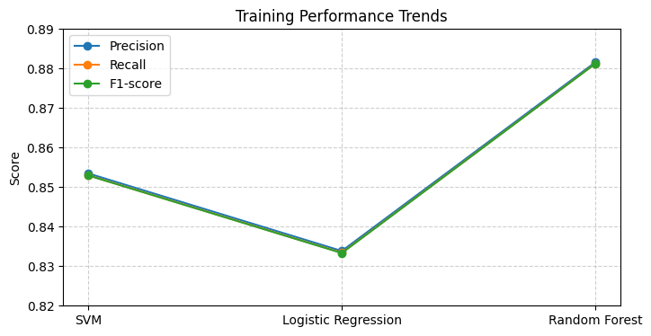
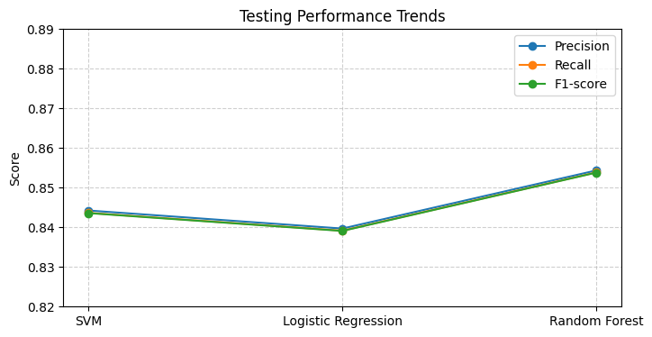
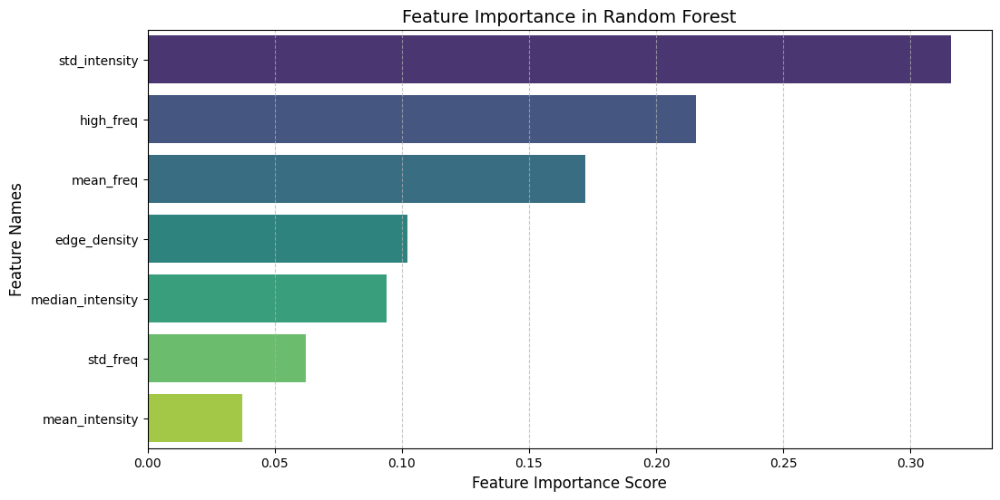
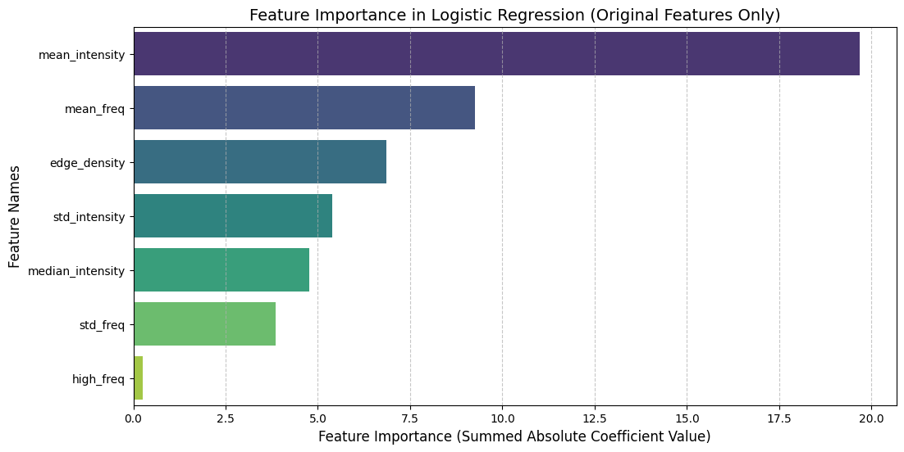

# AI-Generated vs Real Image Classification

This project explores the classification of images as either **AI-generated or real** using **machine learning models** such as **SVM, Logistic Regression, and Random Forest**. Instead of directly using pixel values, we extract meaningful **statistical features** to capture differences in texture, structure, and distribution patterns between AI-generated and real images.

---
## DEMO?
https://ai-image-detector-n39p.onrender.com/
## 🔹 Project Overview

### 📌 Dataset
- **Images labeled as AI-generated (1) or Real (0).**
- **Dataset Size:** Includes a balanced number of AI-generated and real images.
```md

```

### 📌 Feature Extraction
Instead of feeding raw pixel values into machine learning models, we extract **seven statistical features** to differentiate AI-generated and real images effectively.

### 📌 Models Compared
We trained and evaluated three machine learning models:
1. **Support Vector Machine (SVM)**
2. **Logistic Regression**
3. **Random Forest**

---

## 🔹 Feature Extraction & Justification

To enhance classification accuracy, we compute the following seven features:

### **1️⃣ Mean & Median Intensity**
- **Definition:** Measures the average and central tendency of pixel brightness.
- **Reasoning:** AI-generated images often have smoother shading with less variation in intensity, whereas real images may have more natural lighting variations.

📌 **Paste the plot comparing mean intensity distribution here:**



```md

```

### **2️⃣ Standard Deviation**
- **Definition:** Captures variability in pixel intensity.
- **Reasoning:** AI-generated images tend to have more uniform textures, leading to lower standard deviation values compared to real images, which often contain natural noise and gradients.

📌 **Paste the standard deviation comparison plot here:**
```md

```

### **3️⃣ Edge Density**
- **Definition:** Measures the proportion of pixels that form edges in an image.
- **Reasoning:** AI-generated images sometimes have artificially smooth transitions, whereas real images tend to have sharper and more detailed edges.

📌 **Paste the edge density distribution plot here:**
```md

```

### **4️⃣ Frequency Components (Fourier Transform)**
- **Definition:** Extracts high and low-frequency patterns.
- **Reasoning:** AI-generated images may exhibit distinct frequency characteristics, often missing some high-frequency details that are naturally present in real images.

📌 **Paste the frequency component visualization here:**
```md

```

---

## 🔹 Model Performance

### **Training Performance:**

| Model               | Precision | Recall | F1-score |
|----------------------|-----------|--------|----------|
| SVM                  | 0.8535    | 0.8530 | 0.8529   |
| Logistic Regression  | 0.8338    | 0.8334 | 0.8333   |
| Random Forest        | 0.8816    | 0.8812 | 0.8812   |

📌 **Paste the training performance comparison plot here:**
```md

```

### **Testing Performance:**

| Model               | Precision | Recall | F1-score |
|----------------------|-----------|--------|----------|
| SVM                  | 0.8442    | 0.8437 | 0.8436   |
| Logistic Regression  | 0.8397    | 0.8391 | 0.8391   |
| Random Forest        | 0.8543    | 0.8538 | 0.8538   |

📌 **Paste the testing performance comparison plot here:**
```md

```

### 🔹 **Key Takeaways**
- **Random Forest performed the best** due to its ability to handle complex feature interactions and non-linearity.
```md

```
- **SVM showed competitive performance**, benefiting from well-defined decision boundaries.
- **Logistic Regression struggled** as the dataset was highly non-linear and complex.
```md

```
---

## 🔹 Next Steps

To improve classification accuracy further, we plan to:
- **Use CNN-based feature extraction** instead of statistical methods to capture deep visual patterns.
- **Explore ensemble methods** combining multiple classifiers for better generalization.
- **Investigate additional image features** such as color histograms and texture descriptors.

📌 **Paste the roadmap visualization here (if applicable):**
```md

```

---


By following this structured approach, we ensure clarity in understanding how AI-generated images differ from real ones and how our models perform in distinguishing them.
